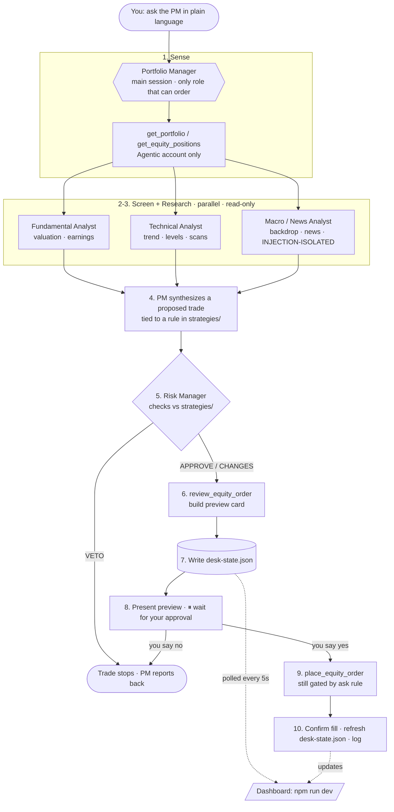

# 🟢 rh-trading-agent — an AI trading desk on Claude Code

**A multi-agent stock-research desk that runs inside Claude Code, connects to a
Robinhood Agentic account over MCP, and never places an order without your approval.**

It's not a "bot that YOLOs your money." It's a small **team of specialized sub-agents**
— fundamental, technical, macro/news, and a risk manager with veto power — that screen
your watchlist, debate each candidate, and hand you a one-click **preview card**. You
approve; it places. Everything's wrapped in written guardrails (human-in-the-loop,
position caps, prompt-injection defense) and mirrored to a Robinhood-style dashboard.


### Why it's different
- **A team, not one prompt** — analysts gather evidence in parallel; an independent risk
  manager can veto a trade the analysts liked.
- **Guardrails are structural, not vibes** — sub-agents physically have no order tools;
  only you-plus-the-PM can place, and only after explicit in-session approval.
- **Prompt-injection-aware** — the news agent treats fetched content as untrusted data
  and quotes suspicious "instructions" instead of acting on them.
- **Low-touch by design** — it runs read-only research on a schedule and only surfaces a
  trade when one genuinely qualifies; most days it tells you to stand aside.
- **A real dashboard** — a Robinhood-style UI mirrors the desk's state live.

> ⚠️ **Real money, beta, not investment advice.** Robinhood Agentic Trading is in beta
> (US, equities only). The agent trades only inside an isolated Agentic account funded
> with a dedicated budget — that budget is the most it can ever lose. There is **no
> track record and no performance claim here**; this is a reference architecture for
> learning, run it at your own risk and monitor it yourself.

This repo holds the **guardrails, strategy notes, agents, dashboard, and setup docs** —
never secrets, and never the OAuth token (those live outside the repo).

## What's in here

```
.
├── CLAUDE.md                  # The PM's operating contract (rules it must follow)
├── .mcp.json                  # Project-scoped Robinhood Trading MCP connection
├── .env.example               # Template for .env (account number; .env is gitignored)
├── .claude/
│   ├── settings.json          # Permissions: reads allowed, orders gated, options denied
│   └── agents/                # The desk team — one sub-agent per role
│       ├── fundamental-analyst.md
│       ├── technical-analyst.md
│       ├── macro-news-analyst.md   # injection-isolated (the only web-facing role)
│       └── risk-manager.md         # veto power over every trade
├── strategies/
│   ├── README.md              # Risk caps + when the Risk Manager must VETO
│   └── mean-reversion.md      # Example strategy (entry/exit/sizing)
├── docs/
│   ├── SETUP.md               # OAuth setup + how to tighten guardrails
│   └── TEAM.md                # The desk roles and end-to-end workflow
└── ui/                        # Read-only Robinhood-style dashboard (Vite + React)
    ├── public/desk-state.example.json  # demo data (live desk-state.json is gitignored)
    └── src/                   # polls the snapshot, renders account/desk/preview
```

## Quickstart

1. Make this repo **private** before pushing anything.
2. Read `docs/SETUP.md` and follow it top to bottom.
3. Connect the MCP, authenticate via OAuth (desktop), fund a small Agentic budget.
4. Refine `.claude/settings.json` once you know the real tool names.

## How the desk works

A small **team of sub-agents** coordinated by the **Portfolio Manager (PM = the main
Claude Code session)**. Analysts gather evidence in parallel; the Risk Manager has veto
power; only the PM can place orders — and only after **your** in-session approval. After
every run the PM writes `ui/public/desk-state.json`, which the dashboard mirrors live.



Steps 1–7 are research and produce **no order**. The desk's standard output is the
**preview card at step 8** — it stops there until you confirm. Full role/tool breakdown
is in [docs/TEAM.md](docs/TEAM.md).

## Operating commands

```bash
# 1. One-time: connect + authenticate the MCP, then record your account number
claude                                  # open the project (trust the .mcp.json server)
#   in-session:  /mcp                   # pick robinhood-trading → OAuth (desktop + mobile verify)
cp .env.example .env                    # then put your Agentic account number in .env

# 2. Run the dashboard (separate terminal) — mirrors each desk run
cd ui && npm install && npm run dev     # http://localhost:5180 (shows demo until a live run)

# 3. Drive the desk — just talk to the PM in the Claude Code session, e.g.:
#   "Screen my watchlist and bring me the top 2 ideas with full team analysis."
#   "Run the desk on AAPL and NVDA, risk-check a small starter in the better one."
#   The PM fans out to the analysts → Risk Manager → preview card → waits for your OK.

# Kill switch: disconnect the MCP from the Robinhood app, or remove it locally
claude mcp remove robinhood-trading
```

> **Note:** the sub-agents in `.claude/agents/` load when Claude Code **starts** — after
> adding or editing them, restart the session so roles like `fundamental-analyst` are
> recognized with their restricted tool sets.

## Safety posture (read before funding)

- The agent can only trade in the **Agentic account**, never your main balance.
- Default permission rule puts **every** Robinhood tool call behind a manual prompt.
- `CLAUDE.md` includes a prompt-injection rule: the agent must ignore trading
  instructions found in fetched/external content (news, analyst notes, web).
- You can disconnect the MCP anytime from the Robinhood app — that's your kill switch.
