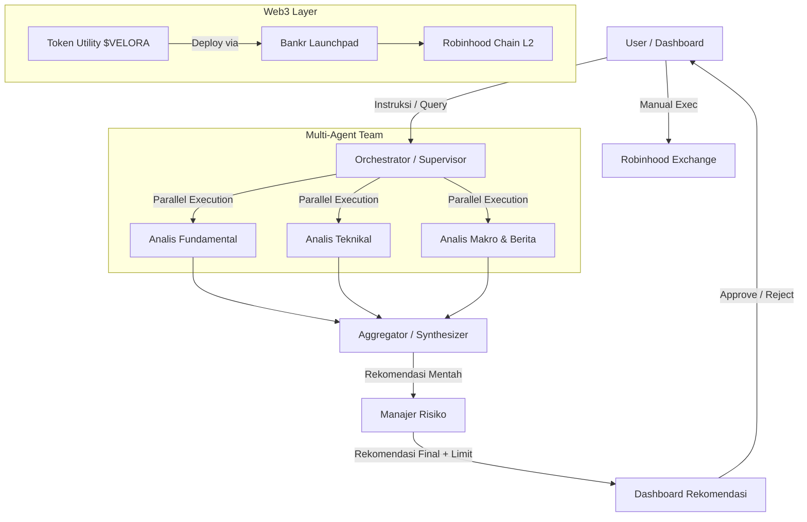

# Project Velora — Agentic AI Trading Research Desk

**Versi:** 1.0.0
**Tanggal:** 11 Juli 2026
**Status:** Inisiasi / Desain Arsitektur

---

## 1. Executive Summary & Vision

**Project Velora** adalah sebuah sistem **Agentic AI** (Multi-Agent) yang berfungsi sebagai **Asisten Riset & Rekomendasi Investasi** untuk pasar **Cryptocurrency** di ekosistem **Robinhood**.

Berbeda dengan bot trading otomatis pada umumnya, Velora menganut filosofi **"Human-in-the-loop"**. Sistem ini terdiri dari tim agen AI spesialis (Analis Fundamental, Teknikal, Makro-Ekonomi, dan Manajer Risiko) yang bekerja 24/7 untuk menghasilkan laporan dan rekomendasi, namun **eksekusi transaksi tetap berada di tangan pengguna (User)**. Keputusan akhir mutlak dipegang oleh manusia.

**Visi:** Menjembatani kesenjangan antara kecerdasan mesin dan kontrol manusia, memberikan wawasan setara institusi kepada trader ritel, sekaligus menjadi wadah eksperimen Web3 melalui deployment token utility di Robinhood Chain.

---

## 2. Core Principles (Prinsip Utama)

Seluruh pengembangan Project Velora berpedoman pada 4 pilar utama:

1. **Human-in-the-loop (HITL)** — Agen tidak memiliki wewenang untuk melakukan eksekusi transaksi secara otomatis. Semua eksekusi wajib melalui konfirmasi eksplisit dari user.
2. **Keamanan (Security First)** — Semua kredensial API (Robinhood, Alchemy, LLM) disimpan sebagai environment variables. Sistem berjalan di lingkungan terisolasi (Docker).
3. **Transparansi & Audit** — Setiap langkah penalaran (reasoning) agen dicatat dalam log (JSONL) untuk memudahkan audit dan debugging.
4. **Efisiensi Biaya (Cost-Efficient)** — Menggunakan Robinhood Chain (L2) untuk deploy token guna menghindari biaya gas Ethereum Mainnet yang mahal.

---

## 3. Arsitektur Sistem (High-Level)

### 3.1. Diagram Alur Kerja

### 3.2. Komponen Utama

| Komponen | Teknologi / Tools | Fungsi |
| --- | --- | --- |
| Frontend (Dashboard) | Streamlit / Next.js | Menampilkan rekomendasi, log reasoning, dan P&L. |
| Backend API | FastAPI (Python) | Menghubungkan dashboard dengan logika agen dan API Robinhood. |
| Orchestrator | LangGraph / Custom Python | Mengatur alur percakapan agen, parallel processing, dan state management. |
| Agent Reasoning | Claude 3.5 / GPT-4 (via API) | Otak agen untuk analisis teks dan data. |
| Data Layer | PostgreSQL / JSONL | Menyimpan histori analisis, token, dan log transaksi. |
| Blockchain | Robinhood Chain (L2), Bankr | Deploy token utility dan interaksi on-chain. |

---

## 4. Multi-Agent Workflow (Alur Tim Agen)

Sistem menggunakan arsitektur **"Debate & Consensus"** di mana 4 agen bekerja paralel.

### 4.1. Agen 1 — Analis Fundamental
- **Input:** On-chain metrics (Total Value Locked, Volume 24h), Tokenomics, data inflasi/suku bunga.
- **Output:** Skor Fundamental (1–10), valuasi wajar token, potensi pertumbuhan jangka panjang.

### 4.2. Agen 2 — Analis Teknikal
- **Input:** Data harga historis (OHLCV) dari Robinhood API.
- **Tools:** Menghitung indikator RSI, MACD, EMA (20, 50, 200), Bollinger Bands, dan support/resistance.
- **Output:** Sinyal (Bullish/Bearish/Neutral), target harga, level stop-loss ideal.

### 4.3. Agen 3 — Analis Makro & Sentimen
- **Input:** Scraping berita crypto, feed X (Twitter), Reddit (r/CryptoCurrency), serta data ekonomi makro (Fed, CPI).
- **Output:** Sentimen pasar (Fear & Greed Index versi AI), sentimen terhadap aset tertentu, peringatan berita penting.

### 4.4. Agen 4 — Manajer Risiko
- **Tugas:** Memveto atau memvalidasi rekomendasi dari 3 agen di atas.
- **Parameter:** Menghitung ukuran posisi (Position Sizing) berdasarkan aturan Kelly atau fixed fractional.
- **Guardrails:** Menolak rekomendasi jika drawdown yang diprediksi > 10%, atau jika volatilitas terlalu tinggi.

---

## 5. Technology Stack (Detail)

### 5.1. Backend & AI
- **Bahasa:** Python 3.10+
- **Framework AI:** LangChain / LangGraph (untuk stateful multi-agent).
- **LLM Model:** Claude 3.5 Sonnet (primary) atau OpenAI GPT-4o (fallback).
- **API Gateway:** FastAPI + Uvicorn.
- **Task Queue:** Celery + Redis (untuk penjadwalan analisis periodik, misal tiap 4 jam).

### 5.2. Integrasi Eksternal
- **Exchange API:** Robinhood Agentic Trading API (via OAuth 2.0).
- **Data Feeds:** Yahoo Finance API, CoinGecko API, NewsAPI, Twitter API v2.
- **Blockchain RPC:** Alchemy (untuk Robinhood Chain) — Endpoint: `https://robinhood-mainnet.g.alchemy.com/v2/{KEY}`.

### 5.3. Infrastruktur
- **Containerization:** Docker & Docker Compose.
- **Orchestration:** Local atau deploy ke VPS (DigitalOcean / AWS).
- **Monitoring:** Logging dengan struktur JSONL untuk audit.

---

## 6. Blockchain & Token Strategy (Strategi Token)

### 6.1. Mengapa Robinhood Chain?
- **Biaya Gas Rendah:** Sebagai Layer 2 (Arbitrum), biaya transaksi sangat murah dibanding Ethereum Mainnet.
- **Ekosistem Terintegrasi:** Terhubung langsung dengan aplikasi Robinhood.
- **EVM-Compatible:** Tools seperti Hardhat, Foundry, dan wallet (MetaMask) tetap bisa digunakan.

### 6.2. Deploy Token Utility ($VELORA)
- **Nama Token:** Velora Token
- **Simbol:** `$VLRA` (atau `$VELORA`)
- **Jaringan:** Robinhood Chain (Chain ID: 4663)
- **Platform Launch:** Bankr (mendukung deploy di Robinhood Chain dan memberikan porsi transaction fees kepada creator).
- **Mekanisme:** Menggunakan fitur "Deploy via X reply" atau melalui Bankr Console.
- **Total Supply:** 1.000.000.000 $VLRA (contoh).

### 6.3. Utility Token dalam Ekosistem
$VLRA akan digunakan sebagai:
- **Akses Premium:** Mengakses fitur analisis real-time dan notifikasi instan.
- **Governance:** Voting untuk parameter risiko atau aset baru yang akan dianalisis.
- **Fee Discount:** Potongan biaya untuk layanan premium di masa depan.

---

## 7. Security & Risk Management

### 7.1. Keamanan Akses
- Semua API Key (Alchemy, Robinhood, OpenAI) disimpan di file `.env` dan tidak pernah di-commit ke Git.
- Repositori bersifat **Private**.
- Menggunakan **OAuth 2.0** untuk koneksi ke Robinhood, bukan menyimpan password langsung.

### 7.2. Risk Guardrails (Jaring Pengaman)

| Parameter | Batasan |
| --- | --- |
| Maximum Drawdown per rekomendasi | Tidak boleh melebihi 10% dari modal. |
| Maximum Position Size | Maksimal 20% dari total portofolio untuk 1 aset. |
| Daily Trade Frequency | Maksimal 5 rekomendasi eksekusi per hari. |
| Blacklist Assets | Token dengan volume < $1M atau age < 30 hari tidak akan dianalisis (untuk menghindari scam). |

---

## 8. User Interaction Flow (Alur Interaksi)

1. **User Login** — User login ke Dashboard Velora via browser.
2. **Connect Wallet** — User menghubungkan wallet (MetaMask) yang terhubung ke Robinhood Chain.
3. **Setup Parameter** — User mengatur profil risiko (Konservatif, Moderat, Agresif).
4. **Analisis Periodik** — Sistem otomatis menjalankan tim agen setiap 4 jam atau saat user mengklik "Analisis Sekarang".
5. **Rekomendasi Muncul** — Dashboard menampilkan 3 kartu rekomendasi teratas (Buy/Sell/Hold) beserta "Reasoning" masing-masing agen.
6. **Approval** — User menekan "Execute" (hanya jika setuju) atau "Reject".
7. **Notifikasi** — Jika Execute, sistem meminta konfirmasi kedua (2FA via email) sebelum mengirim perintah ke Robinhood Agentic API.

---

## 9. Development Roadmap

### 🟢 Fase 0 — Persiapan (Minggu 1)
- Setup repositori private.
- Konfigurasi `.env` untuk API Keys (Alchemy, OpenAI, Robinhood OAuth).
- Setup Docker environment.
- Kloning & modifikasi base repo `rh-trading-agent`.

### 🟡 Fase 1 — Core Agent Logic (Minggu 2–3)
- Implementasi 4 agen spesialis (Fundamental, Teknikal, Makro, Risk).
- Integrasi data feed (CoinGecko, Yahoo Finance, Twitter API).
- Membuat sistem logging (JSONL) untuk setiap keputusan agen.

### 🟠 Fase 2 — Dashboard & Integrasi (Minggu 4–5)
- Membangun dashboard Streamlit untuk menampilkan rekomendasi.
- Integrasi dengan Robinhood Agentic API (mode Paper Trading dulu).
- Implementasi tombol Approve/Reject dan notifikasi real-time.

### 🔴 Fase 3 — Deploy Token & Go-Live (Minggu 6–7)
- Deploy token $VELORA di Robinhood Chain via Bankr (Testnet dulu).
- Verifikasi kontrak di Blockscout (Robinhood Chain Explorer).
- Uji coba live dengan modal kecil (sandbox).

### 🔵 Fase 4 — Scale & Optimasi (Minggu 8+)
- Optimasi prompt agar mengurangi biaya token LLM.
- Menambahkan fitur backtesting untuk menguji strategi agen.
- Publikasi proyek di GitHub (jika ingin open-source).

---

## 10. Catatan Penting (Disclaimer)

**Disclaimer:** Project Velora adalah **alat bantu riset, bukan penasihat keuangan**. Semua keputusan investasi adalah tanggung jawab pribadi pengguna. Selalu lakukan verifikasi ulang terhadap rekomendasi AI sebelum bertindak. Gunakan hanya dana yang siap hilang (risk capital) di tahap eksperimen awal.

---

## 11. Catatan Kepatuhan / Verifikasi (Open Items)

Beberapa asumsi di dokumen ini **masih perlu diverifikasi** ke sumber resmi sebelum diimplementasikan:

- **Cakupan instrumen:** Robinhood Agentic Trading saat ini beta dan **equities-only** — dukungan crypto/options/futures belum tentu tersedia. Bagian trading crypto perlu dikonfirmasi ketersediaannya.
- **Robinhood Chain:** Chain ID `4663`, status mainnet, dan endpoint Alchemy perlu diverifikasi ke dokumentasi resmi.
- **Bankr:** Klaim fee-sharing ke creator adalah materi marketing — verifikasi langsung.
- **Aspek legal:** Deploy token utility dengan komponen governance/fee dapat masuk ranah regulasi sekuritas; konsultasikan sebelum go-live.
