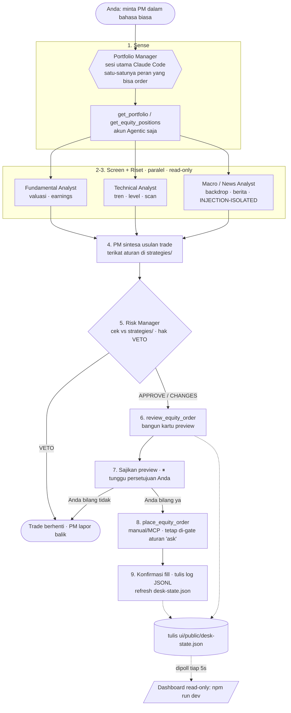

# Project Aelix — Agentic AI Equity Research Desk

**Versi:** 2.0.0
**Tanggal:** 11 Juli 2026
**Status:** Implemented — equities research desk (v2)

---

## 1. Executive Summary & Vision

**Project Aelix** adalah sebuah **research desk berbasis Agentic AI (Multi-Agent)** yang
berjalan **di dalam Claude Code** dan terhubung ke sebuah **akun Robinhood Agentic**
melalui MCP (Model Context Protocol). Fungsinya adalah **asisten riset & rekomendasi
saham (equities)** — sebuah tim analis AI yang menyaring watchlist, memperdebatkan setiap
kandidat, dan menyerahkan sebuah **kartu preview order** kepada Anda.

> **Ruang lingkup yang sebenarnya:** ini **hanya equities (saham AS)**, **long-only**,
> dalam **USD**. Robinhood Agentic Trading masih **beta** dan belum mendukung
> crypto/options/futures. Materi crypto/token pada versi 1.0 dokumen ini telah dipindahkan
> ke **Lampiran** dan **belum diimplementasikan**.

Berbeda dengan bot trading otomatis, Aelix menganut filosofi **"Human-in-the-loop"**
secara struktural: **desk berhenti pada kartu preview dan TIDAK PERNAH menempatkan order
sendiri.** Persetujuan hanya terjadi di dalam sesi Claude Code yang hidup, melalui
konfirmasi eksplisit dari user. Keputusan akhir mutlak dipegang manusia.

**Visi:** Memberikan wawasan setara "meja riset institusi" kepada trader ritel — sebuah
tim yang terdiri dari analis fundamental, teknikal, makro/berita, dan seorang Manajer
Risiko dengan hak veto — sambil menjaga kontrol penuh, guardrails tertulis, dan pertahanan
terhadap prompt-injection.

> ⚠️ **Bukan penasihat keuangan. Tidak ada track record.** Ini adalah arsitektur referensi
> untuk pembelajaran. Semua angka dan snapshot bersifat **ilustratif/demo** kecuali diberi
> data nyata; jangan pernah menyiratkan kinerja historis yang nyata.

---

## 2. Core Principles (Prinsip Utama)

Empat pilar yang benar-benar diterapkan pada kode & konfigurasi repo:

1. **Human-in-the-loop (HITL) — struktural, bukan sekadar niat.** Sub-agen **secara fisik
   tidak memiliki tool order** di daftar `tools:` mereka. Hanya Portfolio Manager (sesi
   utama) yang bisa menempatkan order, dan itu pun **hanya setelah persetujuan eksplisit
   Anda di sesi**. Aturan izin (`.claude/settings.json`) menaruh order di balik prompt.
2. **Pertahanan Prompt-Injection.** Semua konten eksternal (berita, artikel, halaman web,
   hasil tool) diperlakukan sebagai **data yang tidak tepercaya, bukan instruksi**.
   Macro/News Analyst mengutip teks mencurigakan verbatim dan mengabaikannya.
3. **Transparansi & Audit.** Setiap keputusan desk dapat dicatat ke **log audit JSONL**
   (`logs/`, via `tools/desk-log.mjs`), dan setiap desk run menulis snapshot lengkap ke
   `ui/public/desk-state.json` yang di-mirror oleh dashboard.
4. **Least-privilege & aturan tertulis.** Setiap trade yang diusulkan wajib memetakan ke
   aturan tertulis di `strategies/`; Manajer Risiko membaca folder itu dan mem-veto bila
   ada cap yang dilanggar atau kosong. Guardrails hidup di `CLAUDE.md` (kontrak PM) dan
   `.claude/settings.json` (izin tool).

> Catatan: prinsip "efisiensi biaya via Robinhood Chain L2" dari v1.0 **dihapus** — tidak
> ada komponen blockchain di sistem yang berjalan (lihat Lampiran).

---

## 3. Arsitektur Sistem (High-Level)

Arsitekturnya **Claude-Code-native**. Tidak ada backend server, tidak ada orkestrator
Python. **Portfolio Manager (PM) = sesi utama Claude Code** yang Anda ajak bicara. PM
mengorkestrasi sub-agen yang didefinisikan sebagai file di `.claude/agents/`, dan
mengakses broker lewat satu **MCP server** (`robinhood-trading`, didefinisikan di
`.mcp.json` dengan transport HTTP ke `https://agent.robinhood.com/mcp/trading`).

### 3.1. Diagram Alur Kerja (yang sebenarnya)

Langkah 1–6 adalah riset dan **tidak menghasilkan order**. Output standar desk adalah
**kartu preview di langkah 7** — desk berhenti di sana sampai Anda mengonfirmasi.

### 3.2. Komponen Utama (yang ada di repo)

| Komponen | Teknologi / Lokasi | Fungsi |
| --- | --- | --- |
| **Portfolio Manager (Orchestrator)** | Sesi utama Claude Code | Membaca akun, memanggil sub-agen paralel, menyintesis usulan, menyajikan preview, dan (setelah Anda setujui) menempatkan order. |
| **Sub-agen (analis + risk)** | `.claude/agents/*.md` | Empat peran spesialis dengan set tool terbatas (least-privilege). Dimuat saat Claude Code start. |
| **Konektor broker** | `robinhood-trading` MCP — `.mcp.json` (HTTP) | Satu-satunya jalan ke akun Robinhood Agentic; auth via OAuth di sesi. |
| **Guardrails & izin** | `CLAUDE.md` + `.claude/settings.json` | Kontrak operasi PM; aturan izin `deny → ask → allow` (order di-gate, options di-deny, read di-allow). |
| **Strategi & aturan risiko** | `strategies/*.md` | Aturan tertulis (caps + entry/exit) yang di-enforce Risk Manager. |
| **Dashboard (read-only)** | `ui/` — Vite + React, `type: module` | Me-mirror `desk-state.json`; tidak bisa menempatkan order. |
| **Backtester (offline)** | `backtest/` — Node ESM, tanpa dependency | Menguji logika strategi terhadap bar historis, offline, `node` polos tanpa `npm install`. |
| **Audit log (JSONL)** | `logs/` + `tools/desk-log.mjs` + `docs/LOGGING.md` | Menulis jejak audit terstruktur atas desk run, verdict, preview, approval, fill, dan injection alert. |
| **Dokumentasi** | `docs/` (TEAM, SETUP, TRIGGER, LOGGING) | Peran tim, setup OAuth, tombol "Run desk", dan skema logging. |

---

## 4. Multi-Agent Workflow (Alur Tim Agen)

PM men-dispatch sub-agen secara **paralel** untuk mengumpulkan bukti, lalu menyalurkan
hasilnya lewat Manajer Risiko. Setiap agen mengembalikan blok output terstruktur yang
field-nya memetakan 1:1 ke skema `desk-state.json`.

### 4.1. Agen 1 — Fundamental Analyst (`fundamental-analyst.md`, model: sonnet)
- **MCP tools:** `get_equity_fundamentals`, `get_earnings_calendar`, `get_earnings_results`,
  `get_equity_quotes`, `search` (+ `Read`).
- **Output:** `FUNDAMENTAL VERDICT` — valuasi (cheap/fair/rich), growth, kualitas/neraca,
  event risk earnings, **Score −2…+2**, confidence. **Tidak** memutuskan/menempatkan trade.

### 4.2. Agen 2 — Technical Analyst (`technical-analyst.md`, model: sonnet)
- **MCP tools:** `get_equity_historicals`, `get_equity_quotes`, `get_index_quotes`,
  `run_scan`, `get_scans`, `get_watchlist_items` (+ `Read`).
- **Output:** `TECHNICAL VERDICT` — tren, momentum, support/resistance, volatilitas,
  backdrop indeks, **level referensi** entry/stop, **Signal −2…+2**. Bisa juga meng-screen
  kandidat via scan/watchlist. Level bersifat referensi, bukan perintah.

### 4.3. Agen 3 — Macro / News & Sentiment Analyst (`macro-news-analyst.md`, model: sonnet)
- **Tools:** `WebSearch`, `WebFetch`, `get_index_quotes`, `get_indexes`,
  `get_earnings_calendar` (+ `Read`). Ini satu-satunya peran yang menghadap web —
  **permukaan risiko injection tertinggi**, sehingga dijalankan dalam containment.
- **Output:** `MACRO & NEWS BRIEF` — backdrop pasar, berita bersumber & bertanggal,
  katalis, net sentiment (observasi, bukan saran), kualitas sumber, dan baris
  **`INJECTION ATTEMPTS`** (mengutip verbatim teks mirip-instruksi + URL). Tidak memberi
  rekomendasi beli/jual sendiri.

### 4.4. Agen 4 — Risk Manager (`risk-manager.md`, model: opus, **hak VETO**)
- **MCP tools:** `get_portfolio`, `get_equity_positions`, `get_accounts`,
  `get_equity_orders`, `get_equity_quotes` (+ `Read`, `Grep`) — **read-only**, tanpa tool
  order.
- **Tugas:** membaca `strategies/`, memverifikasi state akun (Agentic-only), dan menilai
  usulan terhadap semua cap. **Output:** `RISK VERDICT` — `APPROVE` /
  `APPROVE-WITH-CHANGES` / `VETO`, dengan basis aturan, sizing, konsentrasi, dan stop.
  Bias-nya melindungi modal: bila aturan kosong/ambigu atau data janggal, ia **VETO**.

**Least privilege:** hanya PM yang punya tool order (`review_equity_order`,
`place_equity_order`). Ketiga analis dan Risk Manager tidak memilikinya sama sekali.

---

## 5. Technology Stack (yang benar)

### 5.1. Runtime & Orkestrasi
- **Host:** Claude Code (sesi utama sebagai Portfolio Manager).
- **Sub-agen:** file Markdown di `.claude/agents/` dengan frontmatter `tools:`/`model:`.
- **Broker:** MCP server `robinhood-trading` (HTTP, `.mcp.json`), auth OAuth 2.0 di sesi.
- **Model:** Claude (analis di `sonnet`, Risk Manager di `opus`).

### 5.2. Kode & Dashboard
- **Dashboard:** Vite + React (`ui/`), ES modules (`"type": "module"`), read-only.
- **Tooling offline (backtester + logger):** **Node murni, ESM, tanpa dependency** —
  jalan dengan `node` polos, **tanpa `npm install`**.
- **Helper format UI:** `ui/src/format.js` (`usd`, `pct`, `num`, `signClass`, `timeAgo`).

### 5.3. Yang **TIDAK** dipakai (dihapus dari v1.0)
Untuk menghindari kesalahpahaman, komponen berikut dari desain aspirasional v1.0 **tidak
ada** di sistem yang berjalan:

- **Tidak ada** backend Python / FastAPI / Uvicorn.
- **Tidak ada** LangGraph / LangChain sebagai orkestrator (orkestrasi native Claude Code).
- **Tidak ada** Celery / Redis (penjadwalan memakai `/loop` atau cron sesi-Claude).
- **Tidak ada** PostgreSQL (state = file `desk-state.json` + log JSONL).
- **Tidak ada** Docker / Docker Compose.
- **Tidak ada** layer blockchain / RPC Alchemy / wallet (lihat Lampiran).

---

## 6. Risk Management & Strategi

Sumber kebenaran ada di `strategies/README.md`. Semua persen dihitung terhadap **nilai
akun (NAV) = kas + posisi** dari `get_portfolio.total_value` untuk akun Agentic.

### 6.1. Risk caps aktif

| Aturan | Batas | Catatan |
| --- | --- | --- |
| **Per-trade cap** | **15%** ekuitas per order | Plafon keras satu `place_equity_order`. |
| **Konsentrasi maks.** | **25%** ekuitas per satu simbol | Termasuk semua penambahan. |
| **Posisi terbuka maks.** | **6** | Memaksa diversifikasi di akun kecil. |
| **Order harian maks.** | **4** | Menahan churn (buy + sell per hari). |
| **Stop-loss per posisi** | **−8%** dari average entry | Wajib didefinisikan sebelum order. |
| **Halt rugi harian** | **−5%** P&L hari | Berhenti trading & lapor sisa hari itu. |
| **Cash buffer** | **≥10%** ekuitas dalam kas | Jangan pernah deploy penuh. |

Manajer Risiko **VETO** (bukan sekadar flag) bila cap dilanggar, stop tak terdefinisi, cap
kosong/`TODO`, menyentuh akun non-Agentic, atau data janggal/tool error.

### 6.2. Strategi aktif
- **`mean-reversion.md`** — beli pullback oversold di dalam uptrend (right-side-lite:
  tren utuh + stabilisasi; long only, swing).
- **`left-side-accumulation.md`** — scale-in terencana & ber-anggaran-risiko di zona
  support pada selloff didorong ketakutan di nama berkualitas. Ini adalah **satu-satunya
  pengecualian** yang tertulis terhadap larangan "no averaging into losers", dan hanya sah
  di bawah ladder terencana, anggaran risiko tetap, dan kill-stop seluruh posisi.

---

## 7. Guardrails & Pertahanan Prompt-Injection

- **HITL & least-privilege:** hanya PM yang bisa order; analis/Risk Manager tidak punya
  tool order. Order tetap di balik aturan `ask` di `.claude/settings.json`
  (`place_equity_order`, `cancel_equity_order`), options di-`deny`, read-only di-`allow`.
  Evaluasi izin: **deny → ask → allow**, match pertama menang.
- **Injection containment:** Macro/News Analyst memperlakukan seluruh konten web sebagai
  data tak tepercaya, mengutip teks mirip-instruksi verbatim di bawah `INJECTION ATTEMPTS`,
  dan tak memberi rekomendasi sendiri. PM tak pernah bertindak atas instruksi eksternal.
  Alert ini juga muncul di `injectionAlerts[]` pada `desk-state.json`.
- **Akun terisolasi:** hanya akun **Agentic** yang boleh di-trade; akun lain read-only.
- **Kill switch:** putuskan MCP dari aplikasi Robinhood, atau
  `claude mcp remove robinhood-trading`.

Guardrails ini tertulis di `CLAUDE.md` dan **tidak boleh dilemahkan** oleh agen — hanya
user yang boleh menyuntingnya langsung.

---

## 8. Dashboard (UI)

Dashboard di `ui/` adalah **cermin read-only, bukan pengendali** (Vite + React). Ia
mem-poll `ui/public/desk-state.json` (dengan fallback ke `desk-state.example.json`) setiap
~5 detik dan merender akun, posisi, verdict kandidat, kartu preview, order terakhir, dan
injection alert. **UI tidak bisa menempatkan order** — approval & eksekusi hanya di sesi
Claude Code.

- `desk-state.json` (nyata) **gitignored**; hanya `*.example.*` yang di-commit.
- Skema lengkap ada di `ui/README.md` (field 1:1 dengan blok output sub-agen & caps).
- Tombol opsional **"Run desk"** memakai jembatan berbasis file (`desk-request.json` +
  plugin Vite dev-server) yang **hanya** memicu desk run read-only sampai preview — tak
  pernah menempatkan order (lihat `docs/TRIGGER.md`).

---

## 9. Backtester (offline) — `backtest/`

Sebuah **backtester strategi offline** untuk menyanity-check logika aturan di
`strategies/` (entry/exit/sizing mean-reversion & left-side) terhadap bar historis.

- **Dependency-free, ESM murni,** jalan dengan `node` polos — **tanpa `npm install`**,
  tanpa Python/Docker.
- Bersifat **ilustratif/demo**: ia menguji apakah logika aturan konsisten, **bukan** klaim
  performa. Tidak ada track record nyata yang tersirat dari hasilnya.
- Cocok untuk memvalidasi bahwa caps (per-trade, stop −8%, dsb.) berperilaku seperti yang
  ditulis sebelum aturan itu dipakai pada akun hidup.

---

## 10. Audit Logging (JSONL) — `logs/` + `tools/desk-log.mjs` + `docs/LOGGING.md`

Untuk memenuhi prinsip Transparansi & Audit:

- **`tools/desk-log.mjs`** — helper **Node ESM tanpa dependency** untuk menambahkan record
  audit terstruktur (append-only JSONL).
- **`logs/`** — menampung berkas JSONL berisi jejak: desk run, verdict analis, verdict
  Risk Manager, kartu preview, approval/penolakan user, fill order, dan injection alert.
- **`docs/LOGGING.md`** — mendokumentasikan skema record dan cara pakai.
- Berkas log yang memuat data akun nyata bersifat lokal/gitignored; hanya contoh yang
  aman yang boleh di-commit.

---

## 11. Alur Interaksi & Operasi

1. **Setup sekali:** ikuti `docs/SETUP.md` — sambungkan MCP, OAuth (desktop + verifikasi
   mobile), buat & danai akun Agentic dengan budget kecil (ini plafon kerugian maksimum).
2. **Definisikan strategi** di `strategies/` sebelum trading (Risk Manager VETO bila cap
   kosong).
3. **Jalankan dashboard:** `cd ui && npm install && npm run dev` → `http://localhost:5180`.
4. **Ajak bicara PM** dalam bahasa biasa, mis. *"Screen watchlist saya, bawakan 2 ide
   teratas dengan analisis tim lengkap."* PM fan-out ke analis → Risk Manager → kartu
   preview.
5. **Approve/Reject di sesi.** Hanya jika Anda bilang "ya", PM memanggil
   `place_equity_order` (tetap di-gate aturan `ask`).
6. **Setelah eksekusi:** PM mengonfirmasi fill, menulis log JSONL, dan me-refresh
   `desk-state.json` agar dashboard sinkron.

---

## 12. Development Roadmap (jujur: DONE vs sisa)

### ✅ Sudah diimplementasikan
- **Tim 4 sub-agen** di `.claude/agents/` (fundamental, technical, macro-news, risk) dengan
  set tool least-privilege.
- **Guardrails & izin** — `CLAUDE.md` + `.claude/settings.json` (order di-`ask`, options
  di-`deny`, read di-`allow`).
- **Aturan risiko & strategi** — `strategies/` (caps + mean-reversion + left-side).
- **Pertahanan prompt-injection** — containment Macro/News Analyst + field
  `injectionAlerts`.
- **Dashboard read-only** — `ui/` (Vite + React) me-mirror `desk-state.json` + tombol
  "Run desk" (read-only) via jembatan file.
- **Backtester offline** — `backtest/` (Node ESM, tanpa dependency).
- **Audit logging JSONL** — `logs/` + `tools/desk-log.mjs` + `docs/LOGGING.md`.
- **Dokumentasi** — `docs/` (TEAM, SETUP, TRIGGER, LOGGING).

### 🔜 Belum / berikutnya (dan tetap dalam ruang lingkup equities)
- Menambah strategi baru (momentum/event-driven) sebagai file mandiri yang testable.
- Memperluas cakupan backtest & metrik (mis. berbagai universe & data historis lebih kaya)
  — tetap ilustratif, tanpa klaim performa.
- Penjadwalan lebih matang (di luar `/loop` sesi) bila diinginkan.
- Pengerasan izin lanjutan setelah nama tool riil terverifikasi.

### 🚫 Bukan bagian sistem ini
- Segala fitur crypto/blockchain/token — dipindah ke **Lampiran**, belum diverifikasi &
  belum diimplementasikan.

---

## 13. Catatan Penting (Disclaimer)

**Disclaimer:** Project Aelix adalah **alat bantu riset, bukan penasihat keuangan**. Semua
keputusan investasi adalah tanggung jawab pribadi pengguna. Robinhood Agentic Trading masih
beta (US, equities only); harap awasi sendiri. **Tidak ada track record dan tidak ada klaim
kinerja** — semua data contoh bersifat ilustratif. Selalu verifikasi ulang sebelum
bertindak, dan gunakan hanya dana yang siap hilang (risk capital).

---

## 14. Catatan Kepatuhan / Verifikasi (Open Items)

Asumsi berikut **masih perlu diverifikasi** ke sumber resmi sebelum diandalkan:

- **Cakupan instrumen:** Robinhood Agentic Trading saat ini beta dan **equities-only** —
  dukungan crypto/options/futures belum tersedia. Desk ini sengaja dibatasi ke equities
  long-only.
- **Nama & perilaku tool MCP:** verifikasi nama tool riil via `/mcp` atau
  `claude mcp get robinhood-trading` lalu perketat `.claude/settings.json`.
- **Aspek legal:** setiap fitur di luar equities (mis. token utility bergovernance/fee)
  dapat masuk ranah regulasi sekuritas dan **wajib** melewati review legal sebelum
  dipertimbangkan.

---

## Lampiran — Out of scope / eksplorasi masa depan (BELUM diverifikasi & belum diimplementasikan)

> ⚠️ **Semua materi di bawah ini BUKAN bagian dari desk equities yang berjalan.** Ini
> adalah ide aspirasional dari draf v1.0 yang **belum diverifikasi, belum diimplementasikan,
> dan di-gate oleh review legal/sekuritas.** Tidak ada kode blockchain, RPC, wallet, atau
> token apa pun di repo ini. Bagian ini dipertahankan hanya sebagai catatan eksplorasi masa
> depan — jangan diperlakukan sebagai fitur produk.

### A. Konteks
Draf v1.0 memframing sistem sebagai desk **crypto** dengan komponen Web3. Framing itu
telah **digantikan** oleh desk **equities** Claude-Code-native. Semua elemen crypto/token
berikut dipindahkan ke sini apa adanya untuk arsip.

### B. Strategi Token ($AELIX) — TIDAK diimplementasikan
- Ide token utility `$VLRA`/`$AELIX` di "Robinhood Chain (L2)" dengan supply contoh
  1.000.000.000, di-deploy via **Bankr** launchpad ("Deploy via X reply" / Bankr Console),
  klaim fee-sharing ke creator.
- Utility yang diusulkan: akses premium, governance (voting parameter risiko/aset), diskon
  fee.
- **Status:** spekulatif; klaim Bankr adalah materi marketing yang harus diverifikasi
  langsung; komponen governance/fee dapat memicu klasifikasi sekuritas.

### C. Klaim jaringan/infra blockchain — perlu diverifikasi
- "Robinhood Chain" sebagai L2 EVM-compatible (Chain ID contoh `4663`, status mainnet),
  endpoint RPC **Alchemy** (`https://robinhood-mainnet.g.alchemy.com/v2/{KEY}`), verifikasi
  kontrak di explorer.
- Wallet (MetaMask), Hardhat/Foundry.
- **Status:** Chain ID, status mainnet, dan endpoint **belum** diverifikasi ke dokumentasi
  resmi; jangan diandalkan.

### D. Gating
Sebelum ada bagian dari Lampiran ini yang boleh dipertimbangkan untuk implementasi:
1. **Review legal/sekuritas** menyeluruh (token utility + governance/fee).
2. Konfirmasi resmi ketersediaan instrumen non-equities di Robinhood Agentic.
3. Verifikasi teknis jaringan & pihak ketiga (Robinhood Chain, Alchemy, Bankr).

Sampai ketiga hal itu terpenuhi, ruang lingkup Aelix tetap: **equities-only, long-only,
human-in-the-loop, Claude-Code-native.**
